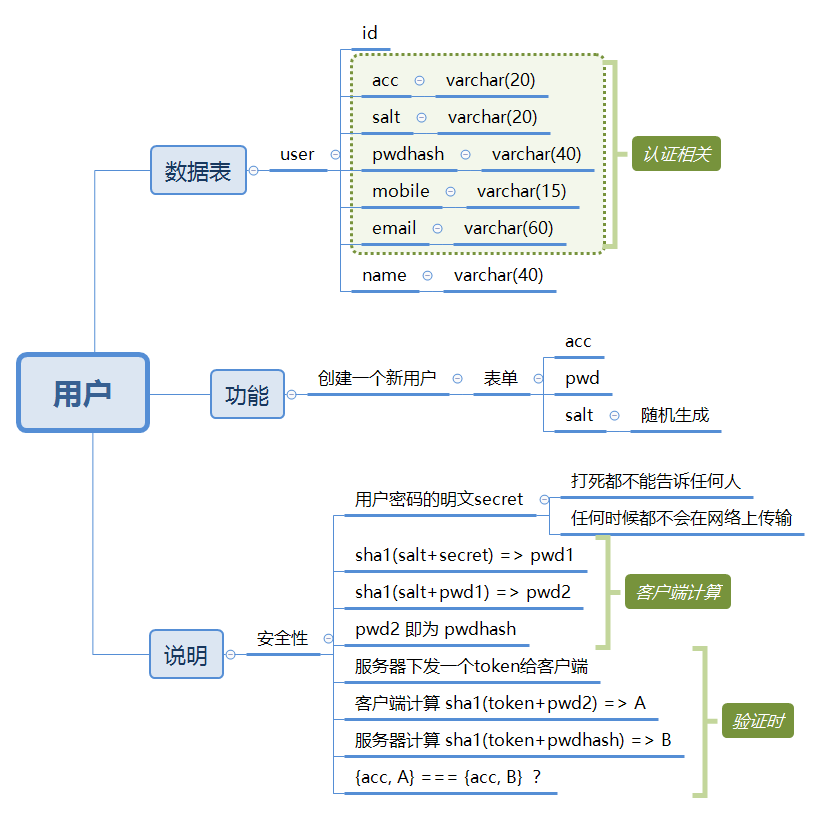

# PHP网站登录的简易解决方案

## 说明

### 基本要求

1. 数据库中，为每个用户配置单独的salt，防止彩虹表攻击。
2. 用户的密码明文（secret）是核心密码，网站严禁以任何形式读取和保存用户的密码明文，只可以保存密码的hash。
3. 用户的密码明文（secret）任何时候都不应该在网络上传输，杜绝网络嗅探风险。

做到了上述三点基本要求，那么即使整个数据库被黑客盗取，黑客也无法得知用户的密码明文信息，起到了保护客户隐私的目的。

### 简易加密方案

先要声明，因为方案目标是简单易行，所以加密算法只采用了低端的sha1/md5加密，因为这两种算法很容易实现前端和后端的处理。但是，对加密有严格要求的场合（比如涉及到钱物等）强烈不建议使用，本方案仅仅用于日常的身份认证场景。

**创建新用户时**

1. 后端随机生成一个saltA，随注册表单formB发给前端。
2. formB包含：预填的saltA（hidden），acc用户名（text），passwd密码（password），passwd2确认密码（password），name姓名（text），mobile手机（text），email（text）等几个字段。
3. 用户填好表格，点击提交。
4. 客户端接管提交处理，计算密文，算法为：`sha1(saltA+密码明文)=>pwd1`，`sha1(salt1+pwd1)=>pwd2`。
5. 客户端把saltA，acc，pwd2，name，mobile，email发给后端，后端保存这些数据到数据库。

**验证用户登录**

1. 后端下发一个login表单formC。formC包含：acc，passwd字段。
2. 用户填写登录表单，点击提交。
3. 客户端接管提交处理，执行两步操作：一、先请求acc的salt，二、拿到salt后再对后端给的一个随机token进行hash，结果给后端验证。具体步骤为：
    a. 向后端查询acc的salt值。
    b. 后端如果没有查到salt（比如acc不存在），提示“账号有误”信息，请客户重新输入，到此结束。
    c. 后端查到了salt，则返回`{salt，随机tokenD}`给前端。
    d. 前端以`sha1(salt+密码明文)=>pwd1`，`sha1(salt+pwd1)=>pwd2`，`sha1(tokenD+pwd2)=>hash`。
    e. 前端把`{acc,tokenD, hash}`发给后端，后端用数据库的 `sha1(tokenD+pwdhash)=>server_hash`，然后比较前端给的`hash`和`server_hash`是否一致。如果一致，说明密码正确，如果不一致，说明密码有误。
    f. 如果密码正确，后端做些写session之类的处理，然后把重定向urlE发给前端，前端拿到urlE后，跳转过去，进到目标页面。
    g. 如果密码错误，后端告诉前端，前端就重新输入。

**示意图如下：**



## 前端页面

```html
<!DOCTYPE html>
<html lang="zh-CN">

<head>
  <meta charset="UTF-8">
  <meta name="viewport" content="width=device-width, initial-scale=1.0">
  <meta http-equiv="X-UA-Compatible" content="ie=edge">
  <title>用户登录</title>
  <script src="/node_modules/jquery/dist/jquery.min.js"></script>
  <link rel="stylesheet" href="/node_modules/bootstrap/dist/css/bootstrap.min.css">
  <script src="/node_modules/bootstrap/dist/js/bootstrap.min.js"></script>
  <script src="/node_modules/crypto-js/crypto-js.js"></script>
  <script src="/node_modules/crypto-js/md5.js"></script>
  <script src="/node_modules/crypto-js/sha1.js"></script>
</head>

<body>

  <div class="container">
    <div class="row">
      <div class="col-sm-12" style="height:10rem"></div>
    </div>
    <div class="row">
      <div class="col-md-4 col-md-offset-4 col-sm-12">
        <div class="login-panel panel panel-default">
          <div class="panel-heading">
            <h3 class="panel-title text-center">用户登录</h3>
          </div>
          <div class="panel-body">
            <form class="form-horizontal" id="form1">
              <input type="hidden" id="salt" name="salt" value="">
              <div class="form-group" id="acc-group">
                <label for="acc" class="col-sm-3 control-label">账号</label>
                <div class="col-sm-9">
                  <input type="text" class="form-control" id="acc" name="acc" placeholder="员工号">
                </div>
                <div id="acc-help" class="col-sm-9 col-sm-offset-3 help-block hidden"></div>
              </div>
              <div class="form-group" id="pwd-group">
                <label for="password" class="col-sm-3 control-label">密码</label>
                <div class="col-sm-9">
                  <input type="password" class="form-control" id="pwd" name="pwd" placeholder="密码">
                </div>
                <div id="pwd-help" class="col-sm-9 col-sm-offset-3 help-block hidden"></div>
              </div>
              <div class="form-group">
                <div class="col-sm-offset-3 col-sm-9">
                  <div class="checkbox">
                    <label>
                      <input type="checkbox" name="remember"> 记住我一周
                    </label>
                  </div>
                </div>
              </div>
              <div class="form-group">
                <div class="col-sm-offset-3 col-sm-9">
                  <button type="submit" class="btn btn-default" id="submit">登录</button>
                </div>
              </div>
            </form>
          </div>
        </div>
      </div>
    </div>
  </div>

  <script>
    var salt = ""; // 服务器随机salt
    var token = ""; // 服务器随机token

    // 接管表单submit事件
    $("#form1").submit(function () {
      $("#acc-group").removeClass("has-error");
      $("#pwd-group").removeClass("has-error");
      check1();
      return false;
    });

    // 第一轮：请求账号的salt
    function check1() {
      acc = $("#acc").get(0);

      // 发起ajax请求
      request = $.ajax({
        url: "/login/salt",
        type: 'post',
        data: {
          "acc": acc.value
        }
      });

      // 请求完成
      request.done(function (data) {
        console.log(data);
        if (data.salt) {
          salt = data.salt;
          token = data.token;
          $("#acc-help").addClass("hidden");
          check2();
        } else {
          salt = '';
          $("#acc-help").removeClass("hidden").text("用户账号有误，请检查后重新输入");
          $("#acc-group").addClass("has-error");
        }
      });

      // 请求失败
      request.fail(function () {
        $("#acc-help").removeClass("hidden").text("抱歉，暂时无法登录");
        $("#acc-group").addClass("has-error");
      });
    }

    // 第二轮：提交一个hash值，用于校验密码
    function check2() {
      acc = $("#acc").get(0);
      pwd = $("#pwd").get(0);

      pwd1 = CryptoJS.SHA1(salt + pwd.value).toString();
      pwd2 = CryptoJS.SHA1(salt + pwd1).toString();
      hash = CryptoJS.SHA1(token + pwd2).toString();

      // 发起ajax请求
      request = $.ajax({
        url: "/login/check",
        type: 'post',
        data: {
          "acc": acc.value,
          "token": token,
          "hash": hash,
        }
      });

      // 请求完成
      request.done(function (data) {
        if (data.code == 200) {
          window.location.href = data.url;
          return;
        } else {
          $("#pwd-help").removeClass("hidden").text("密码不正确，请重新输入");
          $("#pwd-group").addClass("has-error");
          return;
        }
      });

      // 请求失败
      request.fail(function () {
        $("#pwd-help").removeClass("hidden").text("抱歉，暂时无法登录");
        $("#pwd-group").addClass("has-error");
        return;
      });
    }
  </script>
</body>

</html>
```

## 后台PHP片段

```php
switch ($_SERVER["REQUEST_URI"]) {
    case '/login/salt':
        $model = new \App\Models\User;

        $acc = $_POST['acc'];
        $salt = $model->getSalt($acc);  // 从数据库中取出acc的salt。如果acc不存在或者出错，salt为false
        $data = [
            "acc"   => $acc,
            "salt"  => $salt,
            "token" => time(),
        ];
        \Dida\Http\Response::json($data);
        break;

    case "/login/check":
        $model = new \App\Models\User;

        $acc = $_POST['acc'];
        $token = $_POST['token'];
        $hash = $_POST['hash'];

        // 校验前端计算的hash和后端计算的hash是否一致
        $result = $model->verify($acc, $token, $hash);

        if ($result) {
            // 如果一致，说明登录成功，此处做些处理
            // do something

            // 给出登录成功后的跳转地址
            $data = [
                'code'  => 0,
                'url'   => '/user',
                'txtoken' => mt_rand(100000000, 999999999),  // 生成一个随机txtoken
            ];
        } else {
            // 如果校验不一致，code=非零值
            $data = [
                'code'  => 401,
                'token' => time(),
            ];
        }

        \Dida\Http\Response::json($data);
        break;
}
```

## 更新日志

2017-11-29  创建